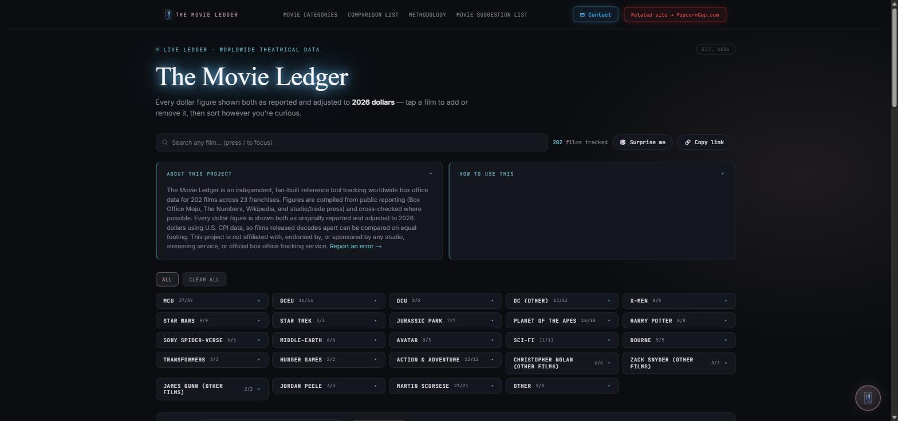

# Hi, I'm Isaac 👋

I build small, sharp tools that turn messy data into clear answers. Based in California.

📫 idr.leach@gmail.com · 🌐 [leach.lovable.app](https://leach.lovable.app/)

---

## 🎬 Featured Project: The Movie Ledger

**[Live site →](https://themovieledger.netlify.app/)**

A worldwide box office data tracker covering **202 films across 23 franchises**. Every dollar figure is shown both as originally reported *and* adjusted to current dollars using U.S. CPI data, so a film from 1977 can be fairly compared against one from 2026.

**What it does:**
- Filters and sorts 200+ films by franchise, director, budget, ticket sales, profitability, and more
- Side-by-side film comparison tool
- Inflation-adjusted financials (gross, budget, marketing spend, net after costs) using CPI methodology
- Timeline view plotting release year against box office performance
- Data compiled and cross-checked from Box Office Mojo, The Numbers, Wikipedia, and trade press

**Why it's here:** it's the same instinct I bring to any data problem. Normalize the numbers, adjust for context, and make the comparison actually fair before drawing conclusions. That's the muscle behind good ROI analysis, not just movie trivia.

---

### 🛠️ More Projects

*(More to come, check back soon.)*

---

⭐️ Thanks for stopping by. Feel free to reach out at idr.leach@gmail.com.
